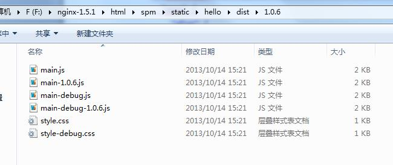
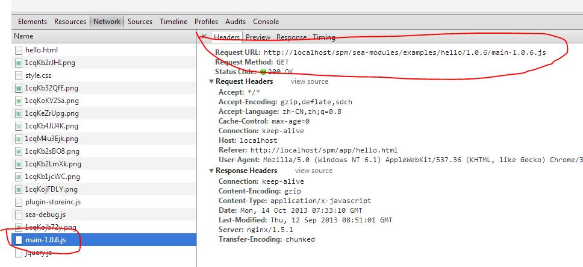

js本地存储和增量更新seajs插件使用
=================================

用增量更新这个算法写了一个seajs插件
storeinc (https://github.com/luyongfugx/storeinc)seajs用户通过使用这个插件结合为之编写的构建工具spm-storeinc-build()
就可以很容易的集成本地存储和增量更新功能
下面我们通过一个例子来展示一下如何使用这个插件.这个例子通过修改seajs官方examples的hello例子来引入storeinc.到
https://github.com/luyongfugx/storeinc/tree/master/

把里面的demo目录下载到自己的web服务器。 
打开sea-moudles/seajs/seajs/2.1.1/目录
我们发现里面有个plugin-storeinc.js，这正是storeinc seajs插件本身

打开app目录下的hello.html,里面已经嵌入了storeinc插件如清单3所示:
清单3. 嵌入storeinc代码
  

并且通过清单4的代码启用了本地存储和增量更新插件

清单4.启用storeinc插件:
    // Set configuration
    //这里是版本，使用storeinc就要遵循它的规范
    var version='1.0.6' 
    seajs.config({
      base: "../sea-modules/",
      alias: {
        "jquery": "jquery/jquery/1.10.1/jquery.js"
      }
    });

    //使用use来启用storeinc插件
    seajs.use('plugin-storeinc', function(store){
      //storeinc插件设置
      //store 表示启用本地存储
      //inc 表示启用增量更新插件
      //jsver 表示版本
      //aliasver 表示定义了别名的js的版本，这个跟其他脚本做了区分，不走增量更新
      //debug 表示是不是在调试状态，如果是则不走本地存储和增量更新
      store.configStroreInc({
        'store':true,
        'inc':true,
        'jsver':version,
        'aliasver':'1.10.2',
        'debug':false
      });
      // For development
      if(location.href.indexOf("?dev") > 0) {
        seajs.use("../static/hello/src/main");
      }else{
        // For production
        seajs.use("examples/hello/"+version+"/main");
      }
    });

接下来安装构建工具spm-storeinc-build
> npm install spm-storeinc-build -g

然后到static/hello目录下修改package.json构建配置文件为清单5所示内容
清单5. 构建配置文件内容

    {
      "family": "examples",
      "name": "hello",
      "lastversion":"1.0.5", //上个版本号（如果是第一次可以不写）
      "version": "1.0.6",//本次版本号
      "chunkSize":12,//增量更新块大小，填12即可,也可以填其他
      "spm": {
        "alias": {
          "jquery": "jquery"
        },
        "output": ["main.js", "style.css"]
      }
    }

然后在该目录下运行spm-storeinc-build 构建工具下会在dist目录下生成混淆后的js文件.如图5所示:

图5.使用构建工具构建代码后的文件

然后我们将1.0.6文件夹放到,sea-modules\examples\hello文件夹下（js资源从这个目录拉取）
启动web服务器，在浏览器输入http://localhost/spm/app/hello.html ,访问正常，看一下网络请求，由于是第一次访问所以，看到js访问了main-1.0.6.js这个文件,如图6所示

图6. 1.0.6版本js第一次访问时的http请求截图

另外看一下localstorage，已经把这个文件内容和版本号存入了本地存储,如图7所示
图7 1.0.6版本js第一次访问时的本地存储内容截图

 
再刷新一次，已经不会有main-1.0.6.js这个请求，但是功能ok，说明程序是从本地存储读取js内容的,较少了网络请求，加快了速度并减少了流量

接下来看下增量更新,我们分别修改static\hello\src目录下的main.js和spinning.js
在main.js和spinning.js里面修改几个console.log的日志输出修改原来的1.0.6为1.0.7
分别如图8，图9所示
图8.  1.0.7 main.js修改内容截图
 

图9  1.0.7 spinning.js修改内容截图

 

然后修改package.json,把版本修改为1.0.7,把上个版本修改为1.0.6如图10所示:

图10.  1.0.7打包package.json版本信息内容
 
然后执行spm-storeinc-build 命令进行构建，这时候发现在dist目录下生成了一个1.0.7目录，如图11所示。
图11. 1.0.7版本js构建后的文件列表
 
发现多了一个main-1.0.6_1.0.7.js的js文件这个文件就是传说中的增量文件了，就是说这个文件的内容是main.js从1.0.6变化到1.0.7所修改的内容，我们打开文件可以看到如图12所示内容
图12. 增量文件main-1.0.6_1.0.7.js内容
 

发现这里只有刚才修改的js的更新内容,然后我们将1.0.7文件夹放到,sea-modules\examples\hello文件夹下,并修改\app\hello.html把版本改为1.0.7,然后重新访问
http://localhost/spm/app/hello.html ,这时候发现浏览器访问的是main-1.0.6_1.0.7.js这个增量文件，如图13所示
图13. 1.0.7版js http请求截图
 
整个页面功能也都ok,在看看console平台，发现我们刚才的修改已经生效，console打出了1.0.7版本的相关信息，如图13所示

图13.  1.0.7版js的console输出截图
 
说明增量更新已经生效，浏览器以最小的流量损耗是想了一次js版本更新，以这个demon为例，如果走普通的版本更新方式，需要全两下载main.js，需要下载一个2k的文件，而走增量更新则只需要下载0.5k左右的文件，流量大大节省！
 
